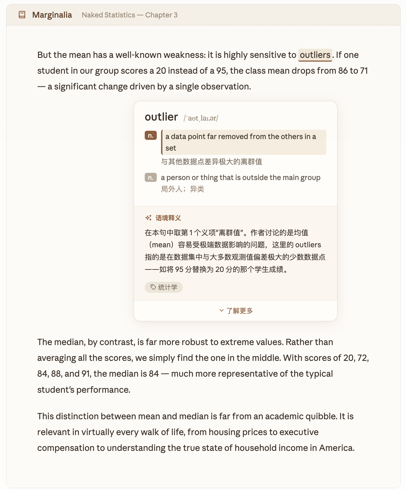
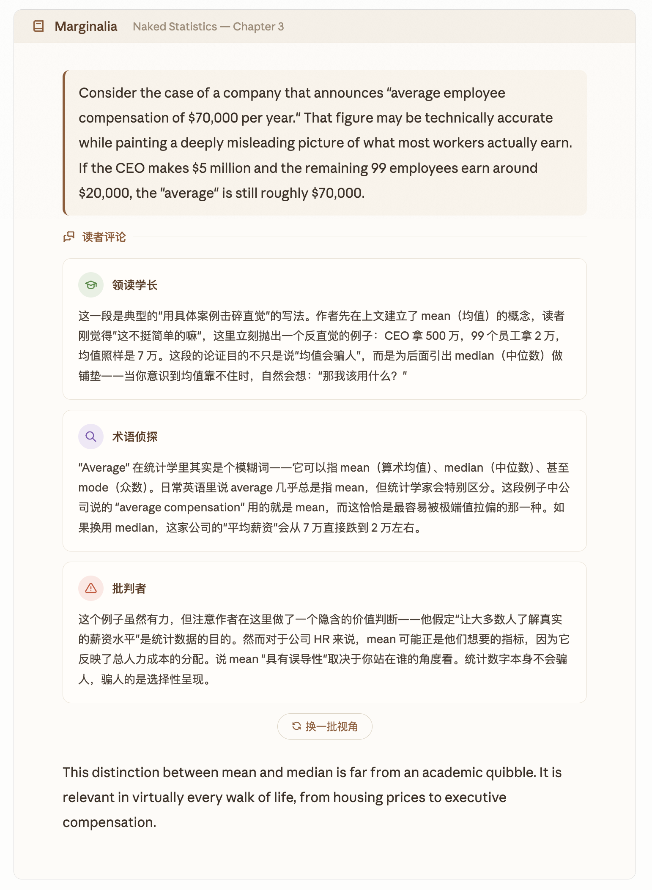
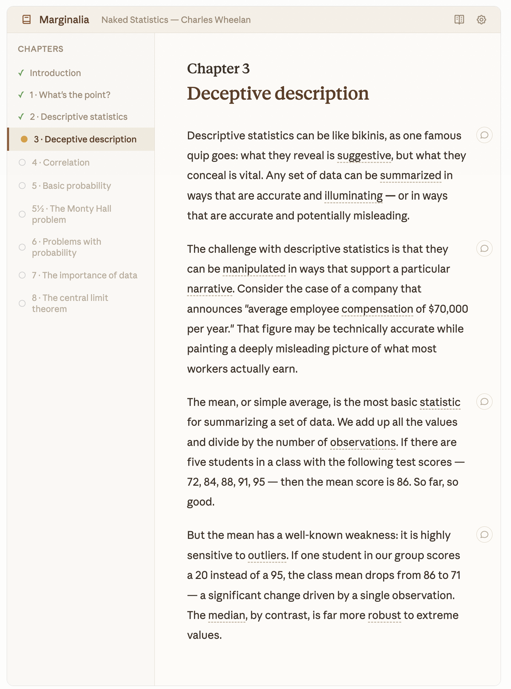

<p align="center">
  
</p>

<h1 align="center">Marginalia</h1>

<p align="center">
  让中文母语者读英文学术文献时，拥有一本活的词典和一群先读过这本书的同伴。
</p>

<p align="center">
  <a href="#quick-start-快速开始">快速开始</a> ·
  <a href="#features-功能">功能</a> ·
  <a href="#architecture-架构">架构</a> ·
  <a href="#contributing-参与贡献">贡献</a> ·
  <a href="#license-许可证">许可证</a>
</p>

<p align="center">
  
  
  
</p>

---

**Marginalia** is an AI-powered academic reading tool for Chinese-speaking scholars. Upload an English PDF, click any word for dictionary definitions with AI-powered contextual explanations, and summon a panel of six reader personas who annotate paragraphs from different analytical angles — like having a study group that already read the book.

---

## Features / 功能

### 📖 智能词义查询

点击任意英文单词，即时弹出词义卡片。上半部分由 ECDICT 词典提供权威释义（零延迟），下半部分由 AI 判断当前语境下应取哪个含义并解释原因。词典保证准确性，AI 提供智能性。



### 💬 六角色评论区

读完一段后，点击评论按钮，2-3 位 AI 读者从不同视角为你解读：

- **领读学长** — 梳理论证结构和行文逻辑
- **术语侦探** — 用大白话拆解专业术语
- **批判者** — 指出隐含假设和论证漏洞
- **联想家** — 连接其他学科和现实案例
- **文化翻译官** — 解释西方学术写作的文化预设
- **历史档案员** — 补充历史背景，像译者注一样克制准确



### 📚 章节回顾

读完一章后，领读学长为你做一次章节复盘：论证主线、关键收获、与前章衔接、下章预告。

### 📝 生词本

查过的每个词自动收入生词本，记录原句、语境释义、学科标注，按文档分组，支持多种排序。



---

## Design Principles / 设计原则

**AI 辅助阅读，而非替代阅读。** Marginalia 不提供"一键总结全文"功能。所有功能的目的是降低语言摩擦、增进理解深度，而不是帮你跳过阅读本身。

**主权在读者。** 查词是你主动点击的，评论是你主动召唤的。工具不打断你的阅读流。

**节奏感。** 高强度输入之后需要缓冲。多角色评论区用不同的声音帮你在密集的学术文本中找到喘息的空间。

---

## Quick Start / 快速开始

### 系统要求

- Python 3.10+
- 约 1GB 磁盘空间（含词典数据库）
- AI 服务的 API Key（推荐 [DeepSeek](https://platform.deepseek.com)，国内用户获取方便、成本低）

### 安装

```bash
git clone https://github.com/BaymaxStudio/Marginalia.git
cd marginalia
python3 setup.py
```

安装脚本会自动创建虚拟环境、安装依赖、下载词典数据库（约 800MB）。

### 启动

```bash
python3 run.py
```

浏览器会自动打开。首次使用请在设置页面配置你的 AI 服务 API Key。

---

## Architecture / 技术架构

```
前端 React 19 ──HTTP──▶ 后端 FastAPI (Python)
                              │
                    ┌─────────┼─────────┐
                    ▼         ▼         ▼
               PDF 解析   ECDICT 词典  AI 适配器
              pymupdf4llm  340万词条   Claude / DeepSeek
                                      / OpenAI 兼容
                    │         │         │
                    └─────────┼─────────┘
                              ▼
                     SQLite 本地数据库
```

- **词义查询**：ECDICT 权威词典（毫秒级）+ AI 语境解释（异步），双层架构确保准确性
- **评论生成**：六个角色的人设和触发规则定义在 Prompt 模板中，AI 根据段落内容自动选择 2-3 位发言
- **文档解析**：PDF → Markdown → 结构化 JSON，三级结构识别（Markdown 标记 → 正则模式 → AI 兜底）
- **AI 适配器**：可插拔架构，支持 Claude / DeepSeek / OpenAI 兼容服务，用户自选

---

## Contributing / 参与贡献

欢迎贡献！以下是一些当前已知的改进方向：

- [ ] EPUB / DOCX 格式支持
- [ ] 深色模式
- [ ] 生词复习功能（间隔重复）
- [ ] 更多 AI 供应商适配（Qwen, Moonshot, Zhipu）
- [ ] 扫描版 PDF 的 OCR 支持

如果你有想法或发现了 bug，欢迎提 Issue。如果你想贡献代码，请 Fork 本仓库并提交 Pull Request。

---

## Acknowledgments / 致谢

- [ECDICT](https://github.com/skywind3000/ECDICT) — 开源英汉词典数据库
- [PyMuPDF](https://github.com/pymupdf/PyMuPDF) — PDF 解析引擎
- [pymupdf4llm](https://github.com/pymupdf/pymupdf4llm) — LLM 友好的 PDF 文本提取
- [FastAPI](https://github.com/tiangolo/fastapi) — Python Web 框架
- [React](https://github.com/facebook/react) — 前端 UI 框架
- [NLTK](https://github.com/nltk/nltk) — 自然语言处理工具包

---

## License / 许可证

[MIT License](LICENSE) © 2026 Baymax
